# RocketSAMM Architecture - Visual Diagrams

This document contains visual flow diagrams for understanding the RocketSAMM architecture.

---

## 🔄 Swap Transaction Flow

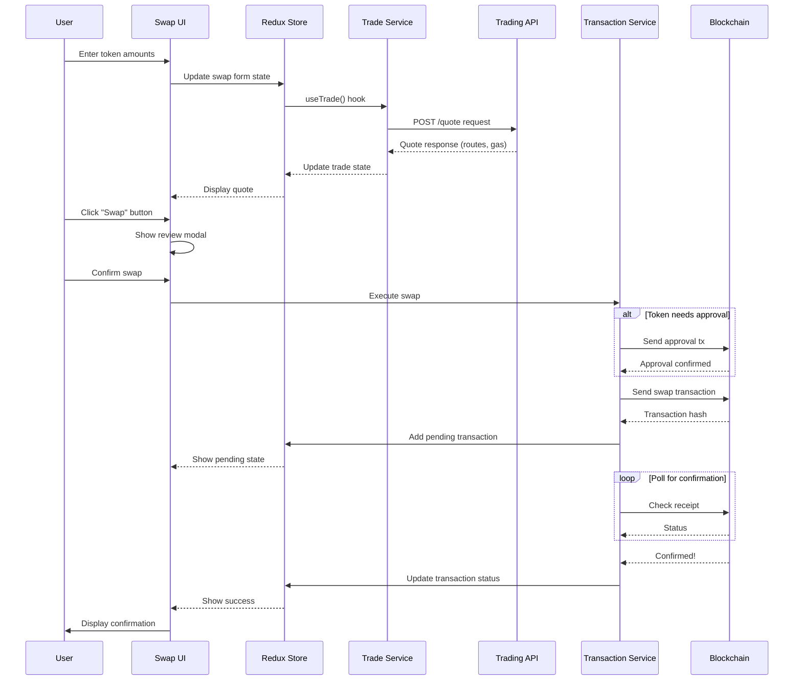

---

## 👛 Wallet Creation Flow

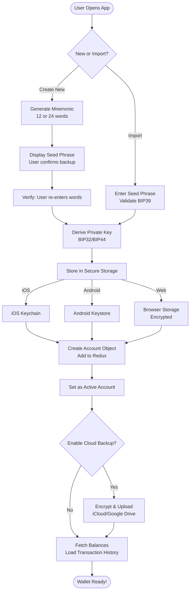

---

## 🌐 dApp Connection Flow (Extension)

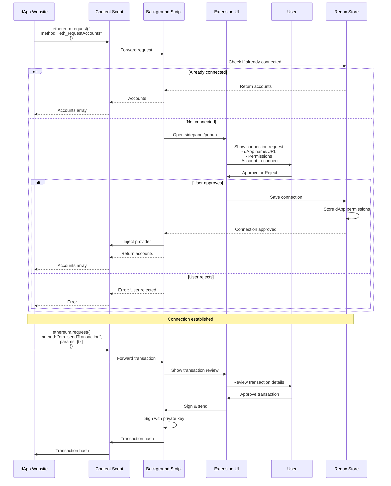

---

## 📊 Portfolio Data Loading

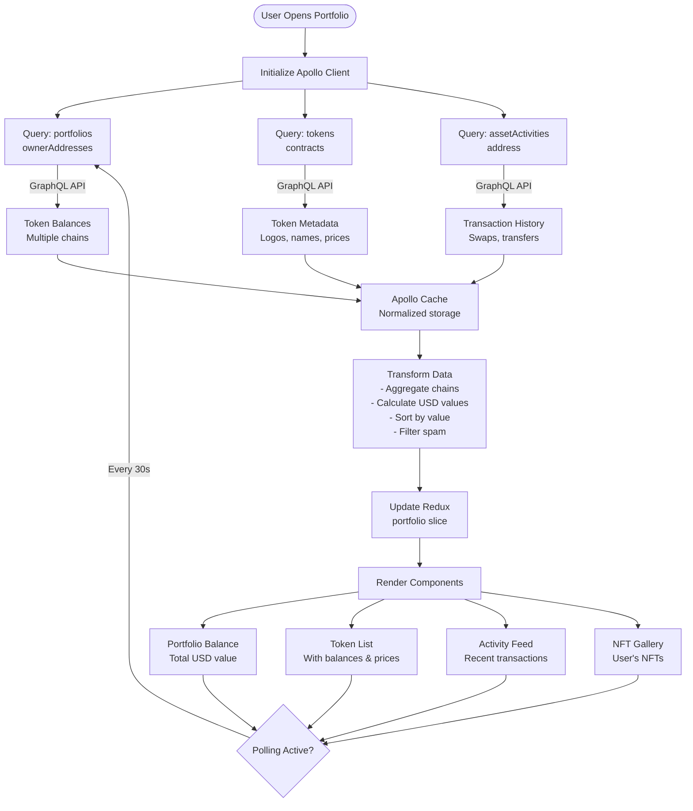

---

## 🔐 Transaction Signing Flow

```mermaid
flowchart TD
    Start([Transaction Request]) --> Type{Transaction Type}
    
    Type -->|Swap| SwapTx[Prepare Swap TX<br/>Encode calldata]
    Type -->|Send| SendTx[Prepare Transfer TX]
    Type -->|Approve| ApproveTx[Prepare Approval TX]
    Type -->|dApp Request| DappTx[From dApp]
    
    SwapTx --> Simulate
    SendTx --> Simulate
    ApproveTx --> Simulate
    DappTx --> Simulate
    
    Simulate[Simulate Transaction<br/>Estimate gas] --> Valid{Valid?}
    
    Valid -->|No| Error[Show Error<br/>Transaction will fail]
    Valid -->|Yes| Review[Show Review Screen]
    
    Review --> UserAction{User Action}
    UserAction -->|Reject| Cancel([Transaction Cancelled])
    UserAction -->|Approve| Auth{Auth Required?}
    
    Auth -->|Yes| Biometric[Request Biometric<br/>Face ID / Touch ID]
    Auth -->|No| GetKey
    
    Biometric --> BiometricResult{Success?}
    BiometricResult -->|No| Cancel
    BiometricResult -->|Yes| GetKey
    
    GetKey[Retrieve Private Key<br/>From secure storage] --> Platform{Platform?}
    
    Platform -->|Mobile/Extension| Native[Sign with RNEthersRS<br/>Rust native module]
    Platform -->|Web| Provider[Delegate to wallet provider<br/>MetaMask, WalletConnect]
    
    Native --> Signed[Signed Transaction<br/>RLP encoded]
    Provider --> Signed
    
    Signed --> Broadcast[Broadcast to Blockchain<br/>Via RPC provider]
    
    Broadcast --> Hash[Receive TX Hash]
    
    Hash --> Store[Store in Redux<br/>transactions slice<br/>Status: "pending"]
    
    Store --> Monitor[Monitor Transaction]
    
    Monitor --> Poll{Poll RPC<br/>Every 3s}
    
    Poll -->|Pending| Monitor
    Poll -->|Confirmed| Success[Update Status<br/>"confirmed"]
    Poll -->|Failed| Failed[Update Status<br/>"failed"]
    
    Success --> Notify1[Show Success Notification]
    Failed --> Notify2[Show Error Notification]
    
    Notify1 --> End([Complete])
    Notify2 --> End
```

---

## 🏗️ Monorepo Package Dependencies

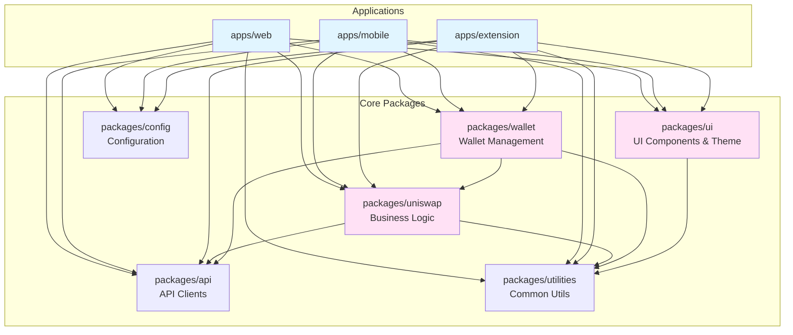

---

## 🔄 State Management Architecture

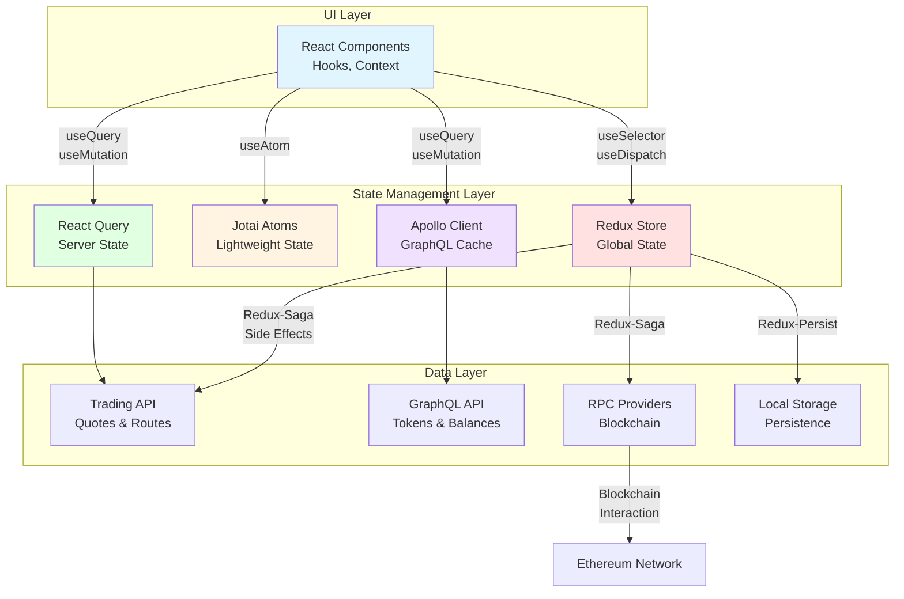

---

## 🌍 Multi-Chain Architecture

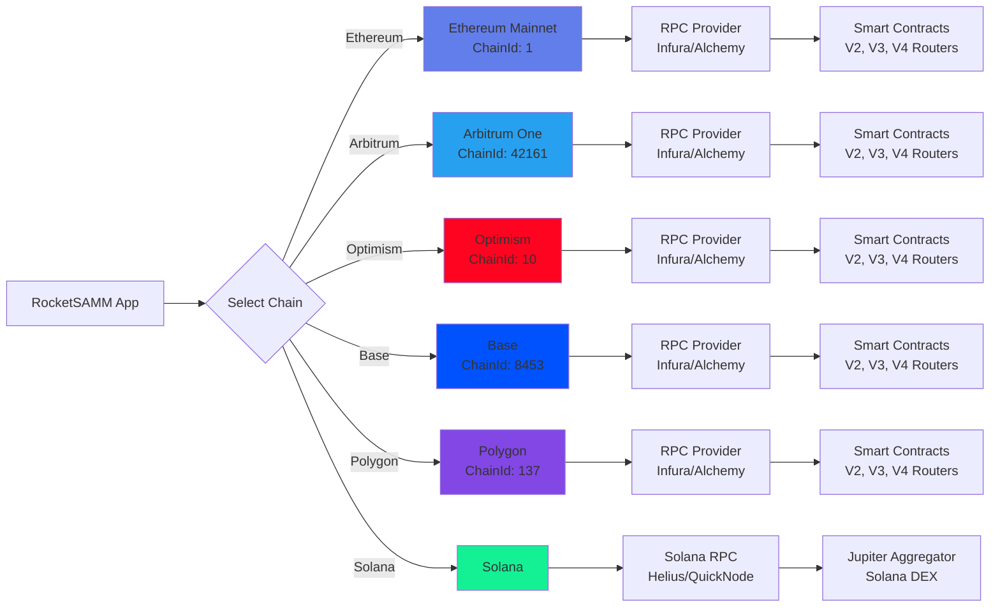

---

## 🔌 Extension Architecture

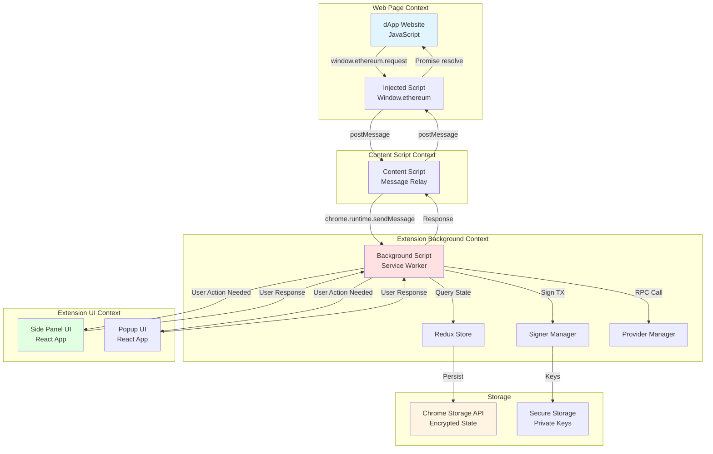

---

## 📱 Mobile App Architecture

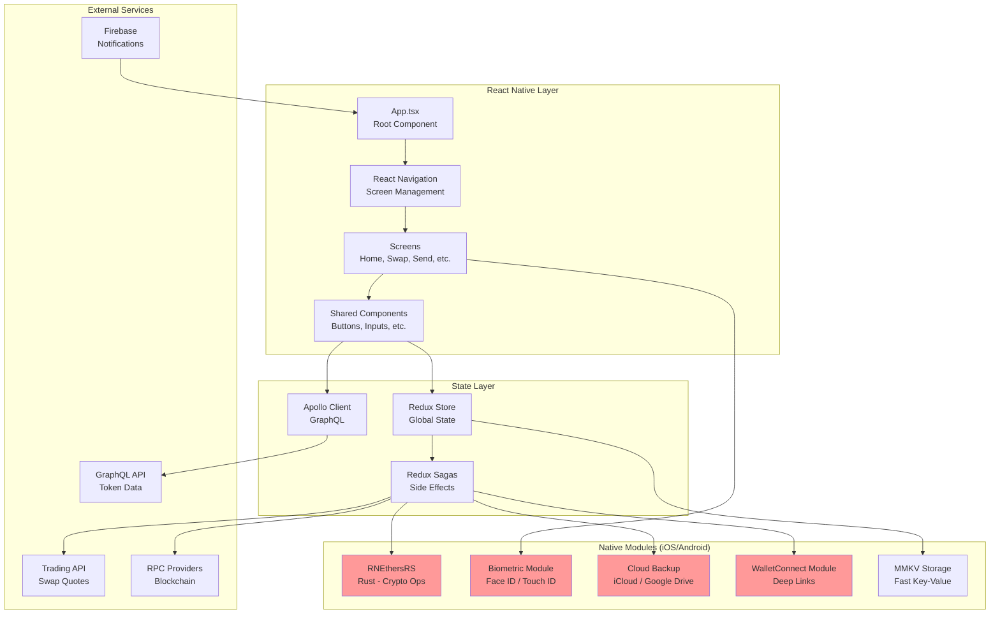

---

## 🎯 Trading API Integration

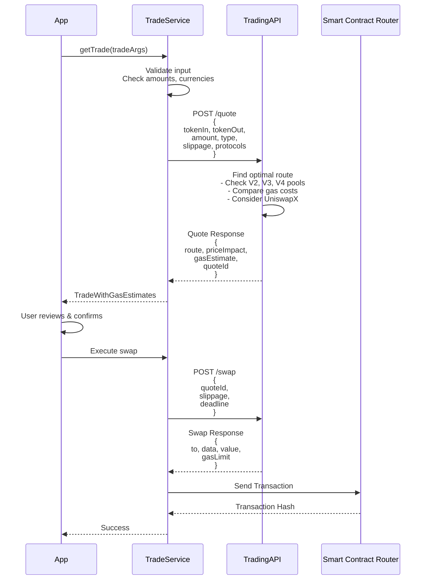

---

## 🗂️ GraphQL Data Flow

```mermaid
flowchart LR
    subgraph "Client"
        Component[React Component]
        Hook[useQuery Hook]
        Cache[Apollo Cache<br/>InMemoryCache]
    end
    
    subgraph "Network"
        HttpLink[HTTP Link]
    end
    
    subgraph "Server"
        GraphQLAPI[GraphQL API<br/>api.uniswap.org/v1/graphql]
        Resolvers[Resolvers]
        DataSources[Data Sources<br/>- Subgraphs<br/>- Databases<br/>- REST APIs]
    end
    
    Component -->|query| Hook
    Hook -->|1. Check cache| Cache
    
    Cache -->|Cache miss| HttpLink
    Cache -->|Cache hit| Hook
    
    HttpLink -->|2. GraphQL query| GraphQLAPI
    GraphQLAPI --> Resolvers
    Resolvers --> DataSources
    
    DataSources -->|Data| Resolvers
    Resolvers -->|Response| GraphQLAPI
    GraphQLAPI -->|3. JSON response| HttpLink
    
    HttpLink -->|4. Update cache| Cache
    Cache -->|5. Return data| Hook
    Hook -->|6. Render| Component
    
    style Cache fill:#ffe1e1
    style Component fill:#e1f5ff
    style GraphQLAPI fill:#e1ffe1
```

---

## 🔒 Security Flow

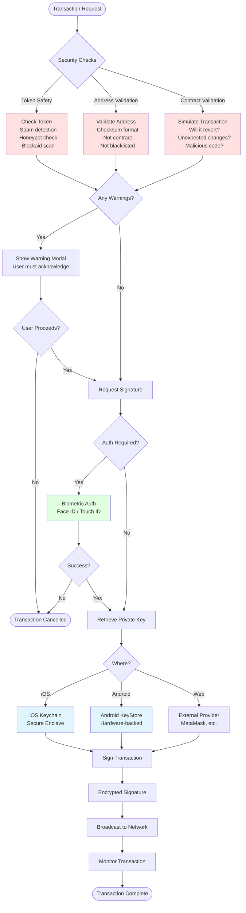

---

## 📈 Performance Optimization Strategies

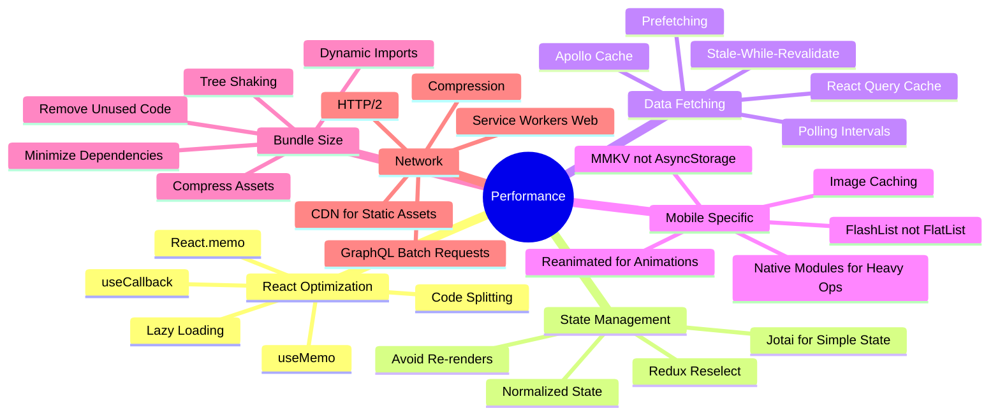

---

## 🎨 Component Communication Patterns

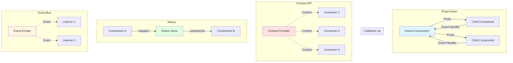

---

These diagrams provide a visual representation of the key architectural flows in RocketSAMM. Use them alongside the main architecture guide for a comprehensive understanding of the system!

